  

  <picture>
    <source media="(prefers-color-scheme: dark)" srcset="https://readme-typing-svg.demolab.com?font=JetBrains+Mono&weight=500&size=20&duration=2800&pause=900&color=5EEAD4&center=true&vCenter=true&width=760&lines=Full-stack+products+from+interface+to+deployment;Building+leakage-audited+AI+systems;Computer+vision+%2B+robotics+%2B+open+source" />
    
  </picture>

  
  
  

## `01 / About`

I am a **full-stack developer** and a **Mechanical Engineering student at Istanbul Technical University**, graduating in **July 2027**. I started programming at age 9 and have since built across the complete software lifecycle.

Most of my work is end to end: **interfaces, APIs, databases, authentication, business workflows, deployment, and maintenance**. I also apply that software foundation to AI, computer vision, robotics, embedded systems, and industrial research.

- Building full-stack products from frontend interaction to backend infrastructure
- Developing research software with academic and industrial collaborators
- Working toward graduate study in Computer Science and Artificial Intelligence
- Contributing fixes, tests, and documentation to established open-source projects

## `02 / Research Focus`

<table>
<tr>
<td width="50%" valign="top">

### Industrial Digital Twin

**Leakage-Audited Resource Prediction and an Anytime Digital Twin for Industrial Fabric Dyeing**

A causally valid machine-learning pipeline for resource prediction and live process estimation. The work includes feature-availability contracts, leakage auditing, temporal validation, uncertainty-aware prediction, and industrial deployment considerations.

</td>
<td width="50%" valign="top">

### Weld Computer Vision

**Automated Melt-Pool Geometry and Weld-Defect Analysis**

An end-to-end Python pipeline for segmenting melt pools, pores, and cracks from micrographs, then converting predictions into calibrated measurements, overlays, annotations, JSON records, and Excel reports.

</td>
</tr>
</table>

## `03 / Selected Builds`

<table>
<tr>
<td width="50%" valign="top">

### [Robot Control Panel](https://github.com/UlikGames/robot-control-panel)

Interactive control and visualization for a 6-DOF robot arm.

`Three.js` `Inverse Kinematics` `D-H Modeling` `Trajectory Planning`

</td>
<td width="50%" valign="top">

### [Robot Simulation](https://github.com/UlikGames/robot-simulation)

Reusable browser-based robotics simulation published as an NPM package.

`JavaScript` `Three.js` `NPM` `Simulation`

</td>
</tr>
<tr>
<td width="50%" valign="top">

### [Composer Portfolio](https://github.com/UlikGames/Composer-Portfolio)

A modern 3D musician portfolio with audio playback, responsive themes, and a serverless contact workflow.

`React` `TypeScript` `React Three Fiber` `Vite`

</td>
<td width="50%" valign="top">

### [Behind the Rooms](https://github.com/UlikGames/Behind-the-Rooms)

A first-person horror game developed and released through multiple public versions.

`Unreal Engine` `Game Development` `Level Design`

</td>
</tr>
</table>

  <a href="https://github.com/UlikGames?tab=repositories"><b>Explore all repositories →</b></a>

## `04 / Engineering Experience`

- **Full-stack development:** Designed and delivered production websites, APIs, databases, authentication, administration tools, order workflows, integrations, and deployment using React, TypeScript, NestJS, Supabase, WordPress, and WooCommerce.
- **Electric vehicle systems:** VCU software, CAN bus integration, LoRa telemetry, BMS and Hall sensor data, Arduino, and Nextion HMI visualization for the ITU KASVA electric car team.
- **Manufacturing improvement:** Video-based work studies, workstation and pallet-layout improvements, production instructions, and an offline factory time-tracking application during a Baymak internship.
- **Open source:** Contribute bug fixes, regression tests, API improvements, documentation, and cross-platform compatibility work across multiple ecosystems.

## `05 / Technical Constellation`

  

<b>More tools and domains</b>

 

**AI and data:** scikit-learn, pandas, NumPy, computer vision, segmentation, regression, temporal validation  
**Full stack:** React, Next.js, NestJS, REST APIs, PostgreSQL, Supabase, authentication, responsive interfaces, deployment  
**Robotics and embedded:** CAN bus, LoRa, Nextion HMI, inverse kinematics, telemetry  
**Engineering:** Digital Twins, process modeling, manufacturing studies, measurement pipelines  
**Workflow:** Git, GitHub Actions, Docker, Linux, LaTeX

## `06 / Open Source`

I contribute where I can leave a repository better than I found it: bug fixes, regression tests, API behavior, documentation, and cross-platform compatibility.

  

---

  Building software from physical systems, one questionable metric at a time.

